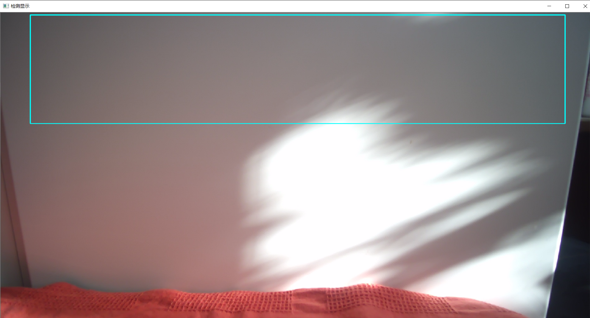
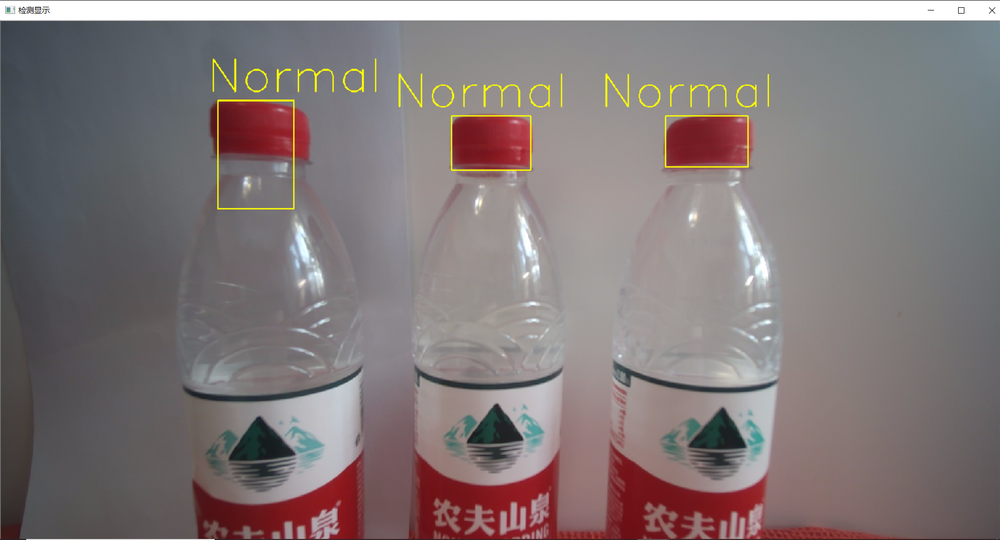
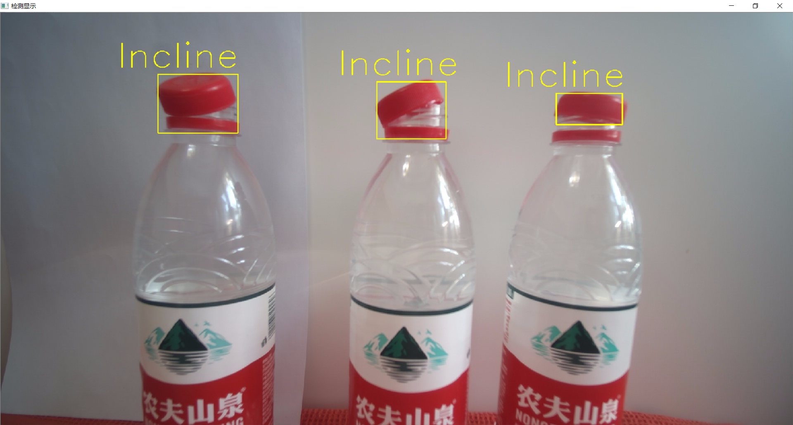
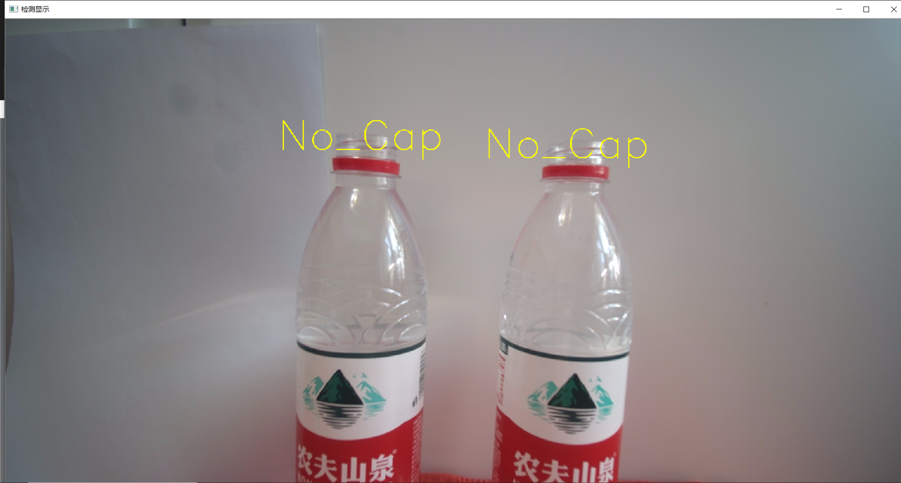
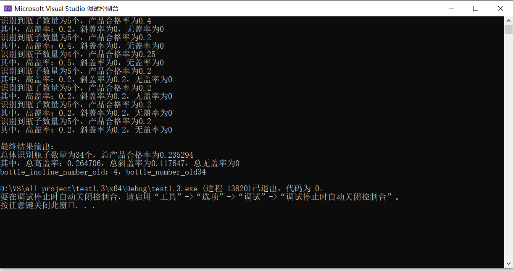

# Qualified-Rate-Recognition-of-Caps-of-Bottled-Water-in-Assembly-Line-based-on-OpenCV

## Overview  
This project presents a real-time bottle cap inspection system built with OpenCV and Visual Studio (C++), using edge detection, contour analysis, and adaptive thresholding to detect tilted, loosely sealed, or missing caps under varying lighting conditions.
It automatically classifies typical defects such as high caps, crooked caps, and improper sealing, while computing real-time qualification rates and defect distributions on bottled water production lines.  

---

## Features  
- **Real-time Detection:** Uses external camera to monitor bottle caps continuously.  
- **Edge & Contour Analysis:** Identifies bottle caps via edge detection, contour extraction, and area filtering.  
- **Defect Classification:** Detects and labels *high caps*, *crooked caps*, *missing caps*, and *normal caps*.  
- **Performance Metrics:** Computes detection count, defect distribution, and qualification rate per test cycle.  
- **Lighting Robustness:** Includes preprocessing, threshold segmentation, and flood-fill filtering to ensure stable detection under varying illumination.

---

## Technical Details  

| Function | Purpose |
|-----------|----------|
| `imread()` | Loads an image from file for testing or calibration. |
| `imshow()` | Displays image frames in real time for visualization. |
| `VideoCapture()` | Acquires live video stream from camera or file input. |
| `split()` | Separates color channels for individual processing. |
| `threshold()` | Performs binary thresholding for segmentation. |
| `morphologyEx()` | Applies morphological operations (open/close/gradient) to remove noise and refine shapes. |
| `findContours()` | Extracts connected components and outlines of detected objects. |
| `contourArea()` | Calculates the area of detected contours for filtering by size. |
| `boundingRect()` | Finds axis-aligned bounding rectangles around contours. |
| `minAreaRect()` | Determines the minimum rotated rectangle to measure cap tilt angles. |
| `floodFill()` | Fills holes and smooths segmented regions to improve detection accuracy. |

---

## Workflow  
The overall workflow consists of image acquisition, preprocessing, cap detection, classification, and real-time result computation.  

### 1. Main Routine (`main()`)  
- Initializes the camera using `VideoCapture()` and sets frame resolution.  
- Captures each frame and clones it for independent processing.  
- Calls the initialization function `initial()` to locate the bottle region.  
- If **no bottle is detected**, a blue bounding box highlights the detection area with the prompt *“No Bottle Detected”*.  
- If a bottle is found, the system sequentially processes each one using `cap_scan()` for cap state evaluation.  

### 2. Initialization Stage (`initial()`)  
- Extracts the label region to limit processing area.  
- Converts the region to grayscale and applies binary thresholding.  
- Performs inversion and `floodFill()` to remove internal holes.  
- Detects the upper green edge of the label to define left and right boundary coordinates for each bottle.  

### 3. Cap Detection Stage (`cap_scan()`)  
- Focuses on the cap area based on coordinates from `initial()`.  
- Applies morphological filtering and contour extraction.  
- Calculates the number of cap contours and their slopes using `minAreaRect()`.  
- If **two rectangles** are found → classify as *High Cap* or *Crooked Cap*.  
- If **one rectangle** is found → further compare cap slope and area to determine *Normal*, *Missing*, or *Tilted* state.  

### 4. Bottle Body Analysis (`bottle_body()`)  
- Detects the top edge of the label area using edge detection.  
- Compares the slope of the cap and the label to evaluate parallelism and determine sealing quality.  

### 5. Result Computation & Display  
- Press **Tab** → Calculates and displays statistics for the current detection cycle, including total bottles, pass rate, and defect ratios.  
- Press **Enter** → Summarizes all recorded results for the full session.  
- Press **ESC** → Ends inspection and resets temporary data.  

### 6. Output and Visualization  
- Draws colored rectangles around detected caps.  
- Annotates detection results (e.g., *Normal*, *Crooked*, *High Cap*, *Missing*, *No Bottle*).  
- Displays real-time camera feed and classification overlays through `imshow()`.  

View the full source code here: [View Code on GitHub](./Code)

---

## Results  

| Status | Description | Example |
|---------|--------------|---------|
| No Bottle Detected | No bottle identified within the detection region |  |
| Normal Cap | Cap is properly tightened and fully sealed on the bottle neck |  |
| Crooked Cap | Cap is loosely tightened and appears tilted on the bottle neck |  |
| High Cap | Cap is incompletely tightened (sitting high or partially threaded) |  |
| Missing Cap | Bottle detected, but no cap region found |  |
| Final Detection Results | The system compiles all detection records |  |

---

## Tools & Environment  
- **Language:** C++  
- **Library:** OpenCV  
- **IDE:** Visual Studio  
- **Platform:** Windows  
- **Camera:** External USB Camera  

---
